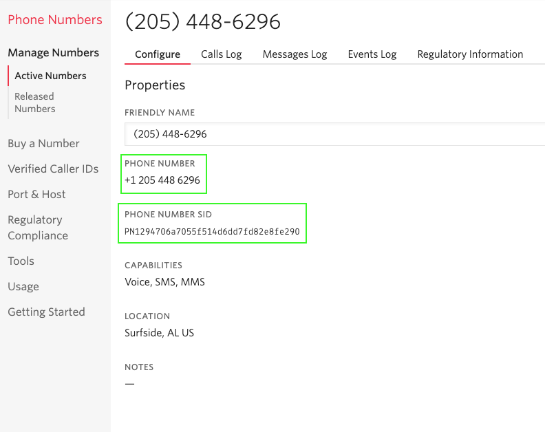
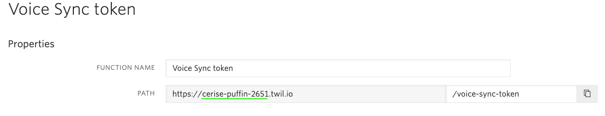
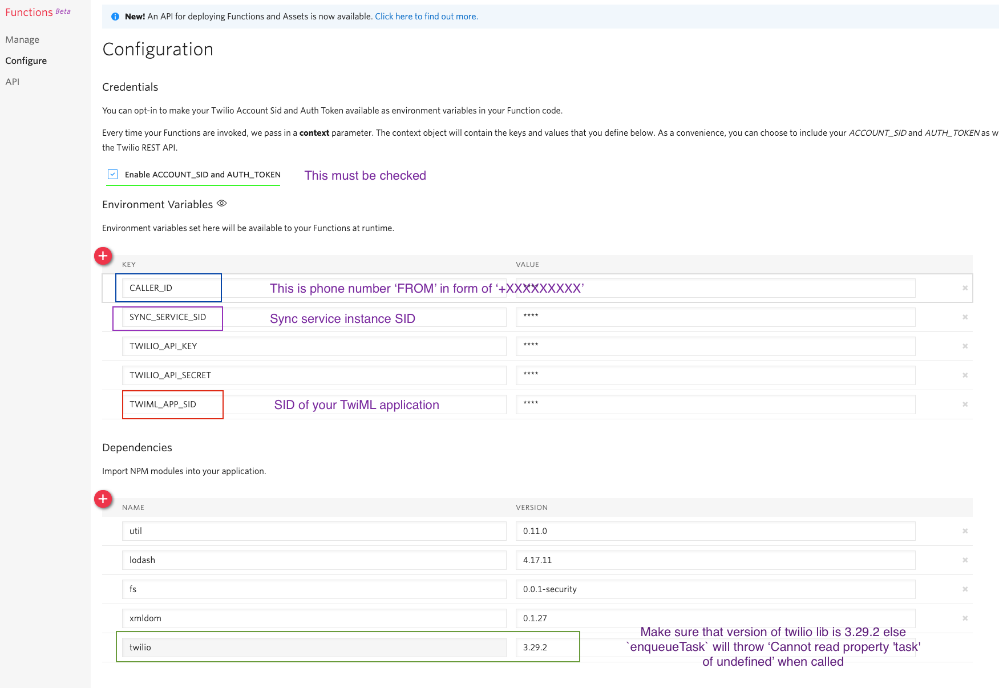
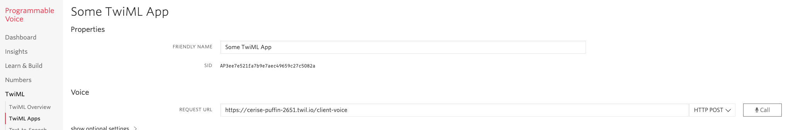
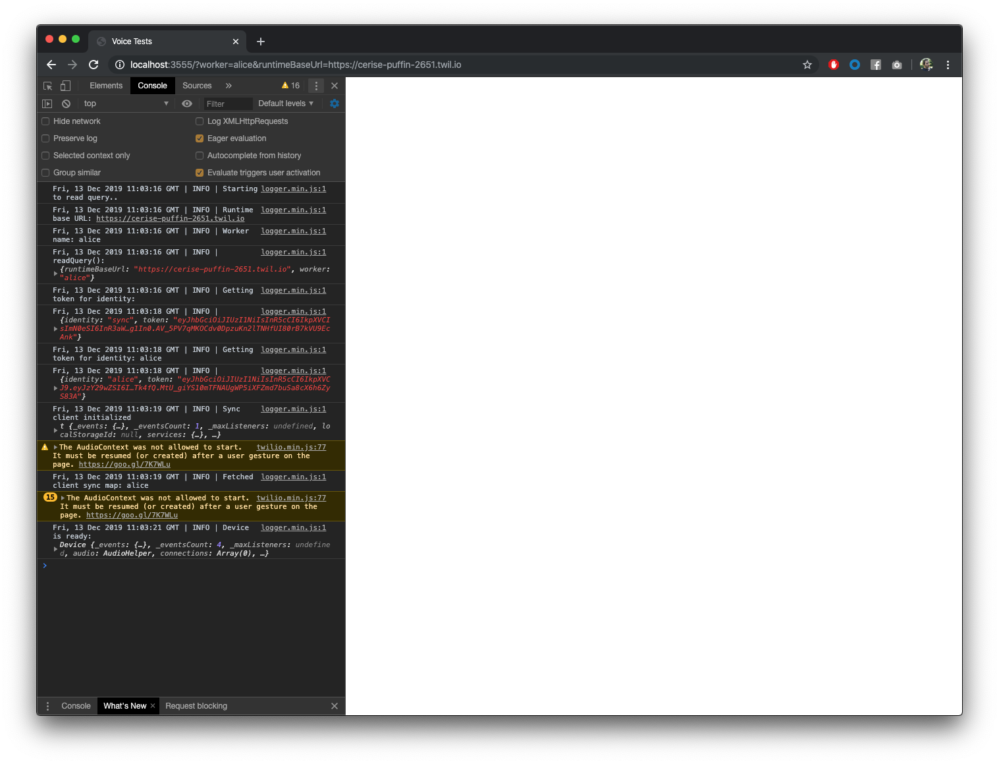

# Voice integration

## Table of contents
- [Account Setup](#account-setup)
  - [Account requirements](#account-requirements)  
  - [Environment variables](#environment-variables)
  - [Sync instance](#sync-instance)
  - [TwiML Application](#twiml-application)
  - [TwiML](#twiml)
  - [Twilio Functions](#twilio-functions)
- [Voice integration components](#voice-integration-components)
  - [Server](#server)
  - [Browser](#browser)  
  - [Sync](#sync)
    -[Sync in node](#sync-in-node)
    -[Sync in browser](#sync-in-browser)
  - [Voice event proxy](#voice-event-proxy)  
- [General test flow](#general-test-flow)

### Account Setup

## Account requirements

Make sure to do the following general setup actions listed [here](https://wiki.hq.twilio.com/pages/viewpage.action?spaceKey=CCIS&title=Taskrouter.js+SDK+e2e+testing+setup+instruction): 

Account must have two valid Twilio phone number.

For the sake of clarity, rename existing phone number to 'FROM' and the newly bought one to - 'TO'

## Environment variables

Following environment variables must be exported within node: (add them to `test.json`)

```
numberToSid   = "PNXXXXXXXXXXXX"
numberFromSid = "PNXXXXXXXXXXXX"
numberTo      = "+XXXXXXXXXXXXX"
numberFrom    = "+XXXXXXXXXXXXX"
runtimeDomain = "sad-cat-101"
```

Numbers and number sids can be found by going [here](https://www.twilio.com/console/phone-numbers/incoming) and clicking on the number


*Note:* Remove any whitespaces from the number

Runtime domain can be found by navigating to any Twilio function [here](https://www.twilio.com/console/functions/manage), opening it and it will be visible on the top.


*Note:* You should only export the runtime domain, as per example: `cerise-puffin-2651`

## Sync Instance

Make sure that the account has a Sync instance by going to [here](https://www.twilio.com/console/sync/services) and seeing if
there is an `Default Service` instance. Normally, every account should have one.

If you do have to make one, go with the default settings. No additional configurations are required.

We only need this Sync instance to exist for Twilio functions in the console. You are not required to have instance SID in the `test.json`

## TwiML Application

For you to be able to make calls from browser to Twilio phone numbers or other voice SDK clients, you need
a TwiML app which will serve as proxy of kind and redirect your calls.

Navigate to [here](https://www.twilio.com/console/voice/twiml/apps) and create a new Application with default template.

## Twilio functions

Following twilio functions are mandatory for the account on which these tests are to be ran.

*Important:* For each function uncheck `Check for valid Twilio signature`

Make sure that the general Twilio function configuration [here](https://www.twilio.com/console/functions/configure) is as seen bellow:


The variables which are set in the general function configuration are accessible via `context` object of each function.

`event` argument in each function is used to access `query` parameters passed to the function call

Example: `https://runtime-domain.twil.io/some-function?cat=love&sky=blue`

In the function you would access them as `event.cat` and `event.sky`

path: `/voice-sync-token`
purpose: generate tokens for clients in the browser

contents: 
```
exports.handler = function(context, event, callback) {
  const response = new Twilio.Response();
  const header = { 'Access-Control-Allow-Origin':'*' };
  
  response.setHeaders(header);

  const ACCOUNT_SID = context.ACCOUNT_SID;
  const AUTH_TOKEN = context.AUTH_TOKEN;
  const SERVICE_SID = context.SYNC_SERVICE_SID;
  const API_KEY = context.TWILIO_API_KEY;
  const APP_SID = context.TWIML_APP_SID;
  const API_SECRET = context.TWILIO_API_SECRET;
  
  const identity = (event.identity) ? event.identity : 'sync';
  
  const AccessToken = Twilio.jwt.AccessToken;
  const SyncGrant = AccessToken.SyncGrant;
  const ClientCapability = Twilio.jwt.ClientCapability;
  
  if(identity === 'sync') {
    const syncGrant = new SyncGrant({
        serviceSid: SERVICE_SID
    });

    const accessToken = new AccessToken(
        ACCOUNT_SID,
        API_KEY,
        API_SECRET
    );
    
    accessToken.addGrant(syncGrant);
    accessToken.identity = identity;

    const opts = { 
        identity: identity,
        token: accessToken.toJwt() 
     };
     
    const body = JSON.stringify(opts);
     
    response.setBody(body);
    callback(null, response);
  } else {
      
    const capability = new ClientCapability({
     accountSid: ACCOUNT_SID,
     authToken: AUTH_TOKEN
    });
    
    capability.addScope(new ClientCapability.IncomingClientScope(identity));
    capability.addScope(new ClientCapability.OutgoingClientScope({
        applicationSid: APP_SID,
        clientName: identity,
    }));
    
    const opts = {
      identity: identity,
      token: capability.toJwt()
    };
    
    const body = JSON.stringify(opts);
    
    
    response.setBody(body);
    callback(null, response);
  }
}
```

path: `/client-voice`
purpose: redirect calls made from browser to another client or Twilio phone number

*Important:* Navigate to your TwiML application created in the previous step and set `Voice request URL` to this function


```
exports.handler = function(context, event, callback) {
    let twiml = new Twilio.twiml.VoiceResponse();

    if(event.To) {
      // Wrap the phone number or client name in the appropriate TwiML verb
      // if is a valid phone number
      const attr = isAValidPhoneNumber(event.To) ? 'number' : 'client';

      const dial = twiml.dial({
        callerId: context.CALLER_ID,
      });
      dial[attr]({}, event.To);
    } else {
      twiml.say('Thanks for calling!');
    }

     callback(null, twiml);
};

/**
* Checks if the given value is valid as phone number
* @param {Number|String} number
* @return {Boolean}
*/
function isAValidPhoneNumber(number) {
  return /^[\d\+\-\(\) ]+$/.test(number);
}
```

path: `/enqueueTask`
purpose: Returns a dynamically generated TwiML for enqueueing task

```
exports.handler = function(context, event, callback) {
    const workflowSid = event.workflowSid;
    const taskAttributes = event.taskAttributes;
	const twiml = new Twilio.twiml.VoiceResponse();
    twiml.enqueue({ workflowSid: workflowSid }).task({}, taskAttributes);
	callback(null, twiml);
};
```

## Voice integration components

In this section you are not required to do anything. 

It serves as informative material about what each component of the integration is responsible for and how to use it.

### Server

`voice.html` - an HTML page which when opened will fetch Sync/Voice tokens, initialize clients and attach voice and sync listeners.

Voice SDK can only be used `client-side` so we have to host this web page locally to interact with Voice SDK.

The hosting of the `voice.html` page is done via a simple node HTTP server. 

When you open the hosted page on `http://localhost:{port}` there will be no UI elements and any action will be visible only in the console of the browser.


To successfully initiate the page, you must pass the following query parameters (both are mandatory):

`worker` - name of the worker you are initializing
`runtimeBaseUrl` - full url of the runtime, available via `env.runtimeBaseUrl`

Runtime domain is required to fetch Sync and Voice tokens from Twilio.

*Note:* You don't have to export `runtimeBaseUrl`, based on the exported `env` and `runtimeDomain` it will generate a `runtimeBaseUrl` and append it to `test.json`

*Note:* If you want voice client in the browser to be tied to a TaskRouter worker, then parameter `worker` must match second part of the `contact_uri` of the worker.

Example - Starting server:

```
import { serveVoiceHtml } from './test/util/VoiceHelper'

await serverVoiceHtml(3333);
```

Keep in mind that `serveVoiceHTML(PORT)` will return a promise


Example - Opening page:

Alice attributes: `{"contact_uri":"client:alice"}`

Query: `http://localhost:{port}?worker=alice&runtimeBaseUrl=https://cake-lord-101.twil.io` 

### Browser

For launching and killing browser we are using official GoogleChrome npm package `chrome-launcher`

It is a lightweight Node module which will locate Chrome on the OS and use it for spawning browser instances.

Example:

```
import { browserLauncher } from './test/util/VoiceHelper'

const aliceBrowser = await browserLauncher(STARTING_URL, CHROME_FLAGS);
await aliceBrowser.kill();
```

`STARTING_URL` should always be the full URL of the desired worker, mentioned in the previous section.

`CHROME_FLAGS` by default are optional parameter, `String[]` will will concat any flags to the default ones.

The following flags are used by default for every browser instance and currently you can't replace then

```
'--headless',
'--disable-gpu',
'--allow-file-access-from-files',
'--use-fake-device-for-media-stream',
'--use-fake-ui-for-media-stream',
'--disable-web-security',
'--allow-file-access'
```

### Sync

Sync is what makes all of this possible, so understanding this is important. 
Sync clients are initialised both in Node, a single one and one per each `browser` which is spawned.

For each `TaskRouter` worker or `Customer` which requires a `voice client`, we create a Sync map named after the worker in question.

This sync map is used by `Voice event proxy` in Node and directly in the Browser.

This map is a bi-directional transport which is removed and created before each test run and test.

#### Sync in node

Sync client in node lets us read `Voice SDK` events to know in what state the `Voice client` in browser is currently in. 

E.g., Is there an incoming connection? ; Is call muted?

It also lets us send instructions to the `Voice SDK` to interact with the `Voice clinet`.

E.g., Mute call ; Accept call

*Note* We are not directly interacting with Sync maps in the Node besides removing and creating them at certain times. More about that in the `General test flow` section

#### Sync in browser

Sync client in browser is reacting to `Voice events` and storing that information in the `Sync map`

`map.set(EVENT_NAME, EVENT)`

Each event name we put in sync map corresponds to actual `Voice event`.

It also listens on specific remote Sync events for incoming voice instructions, which when triggered will invoke the specific `Voice client` method.

### Voice event proxy

Voice event proxy is an event emitter which will listen on *remote* Sync events and emit them in the Node.

This is done to simplify and make test logic more manageable.

When a voice event is triggered, the event is put in the sync map with the key which is the same as the voice event and the value is the event itself.

When Node receives this event, the key is emitted as an event and value is the specific event itself.

For example:

In browser:
```
// Voice connection being accepeted
connection.on('accepted', event => {
    map.set('connection#accepted, event)
});
```
In node:
```
map.on('itemAdded', args => {
    const eventName = args.items.key; // connection#accepted
    const payload = args.item.value; // event
    emitter.emit(eventName, payload);
});
```

## General test flow

Note: For each `voice client/browser` we must repeat steps with `***` appended to them.

This will illustrate general setup and teardown in context of voice and Sync for a single worker (One browser and voice client - Alice)

* BeforeAll =>
    * Start server - `await serveVoiceHtml(3555)` (page available at http://localhost:3555)
    * Initiate Sync client in Node `const syncClient = new SyncHelper(token)`
    * *** Cleanup - Remove worker sync map - `await syncClinet.removeMap('alice')` (making sure we are starting from a clean slate)
    * *** Create map - `await syncClinet.createMap('alice')` (making the map initially for the first test)
    * *** Launch browser - `const aliceBrowser = await browserLauncher('http:localhost:3555?worker=alice&runtimeBaseUrl=https://cake-lord-101.twil.io)` (starting server with the given url)
* Before => 
    * *** Initiate voice client proxy -> `const aliceVoiceClient = voiceClientProxy(syncClient, 'alice')` - our main interface for interacting with voice client in the browser. This will open an existing Sync Map by the given name in the second argument
* Test => 
    * *** Listen on voice SDK errors via `aliceVoiceClient.on(err => { throw err });`
    * *** Wait for device ready via polling `aliceVoiceClient.waitForEvent('device#ready', 10);` (Since we can't ensure that voiceClientProxy will be initiated before device#ready is received we need to poll Sync map directly. This is required only if your test is attempting to use some browser functionality right away. E.g., making a call to a number to enqueue a task)
    * If test logic does not complete conference, it is mandatory that you complete the conference at the end of the step, either by deleting it via REST or via Voice Client Proxy
* After => 
    * *** Reset the browser page - `aliceVoiceClient.refreshBrowserClient()` (this will refresh the browser and re-initialize all clients - sync and voice)
* AfterAll
    * We kill any browsers - `await aliceBrowser.kill()`
    * We kill the HTTP server - `server.close()`
    
The last step does multiple things, it will
- Destroy voice client and any active connections
- Remove listeners from the existing sync map (alice)
- Remove the map (alice)
- Create a new map with the same name (alice)

Those are the general steps required to make things work.

General idea: 
- we destroy and remake a map(`alice`) in `beforeAll` hook so we start from a clean slate
- when we launch browser it will open that existing map - `alice`
- when we initiate `voiceClientProxy`  in `beforeEach` it will open and existing map(`alice`)
- when we call `refreshBrowserClient` in `afterEach` it will remove map, create map

This way we have a complete and safe cycle
    
Notes:
- Sync these steps are heavy and take time, you should not wait on the following event: `device#ready` because that will happen way before we attach a listener.

`workerVoiceClient` has following methods:
- mute(), accept(), reject(), ignore(), disconnect(), unmute(), refreshBrowserClient(), call(), waitForEvent()

- method `call()` takes {string} argument, which can either be a Twilio phone number or a client name in the browser.
It is useful when you need your `customer` to be an actual voice entity which you can control. But it does take longer for reservation to be made
therefore for simple tests it is advised that you use a simple REST call with a TwiML attached to it.

*Important:* method `waitForEvent()` is directly polling Sync map for a specific key. Due to the nature of how the setup works we cannot guarantee 
that `device#ready` will arrive after we have initialised the `voiceClientProxy` therefore at start of the test we should poll map for that specific event
to make sure `Voice Device` is ready and we can interact with it.

`workerVoiceClient` will emit every voice event there is

